# 🌐 RTGS Risk-Chain Analyzer

<div align="center">

```
╔══════════════════════════════════════════════════════════════════════╗
║                                                                      ║
║     ██████╗ ████████╗ ██████╗ ███████╗                               ║
║     ██╔══██╗╚══██╔══╝██╔════╝ ██╔════╝                               ║
║     ██████╔╝   ██║   ██║  ███╗███████╗                               ║
║     ██╔══██╗   ██║   ██║   ██║╚════██║                               ║
║     ██║  ██║   ██║   ╚██████╔╝███████║                               ║
║     ╚═╝  ╚═╝   ╚═╝    ╚═════╝ ╚══════╝                               ║
║                                                                      ║
║          🔍 Real-Time Gross Settlement Risk Analysis                 ║
║                 🧠 AI-Powered • 🚀 Cloud-Native                     ║
║                                                                      ║
╚══════════════════════════════════════════════════════════════════════╝
```

[](https://choosealicense.com/licenses/mit/)
[](https://nodejs.org/)
[](https://spark.apache.org/)
[](https://cassandra.apache.org/)
[](https://astra.datastax.com/)

</div>

---

## 🎯 Problem Statement

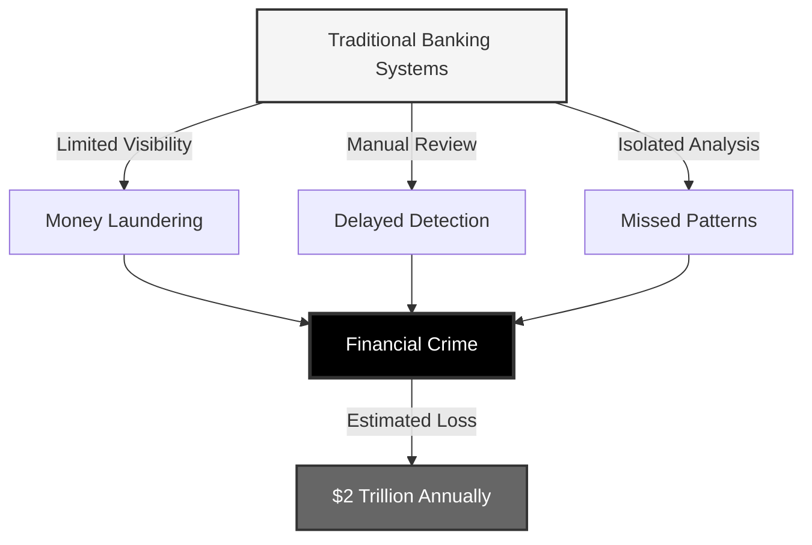

<div align="center">

### **Our Solution: Real-Time Graph-Based Detection**

</div>

---

## 🌟 System Overview

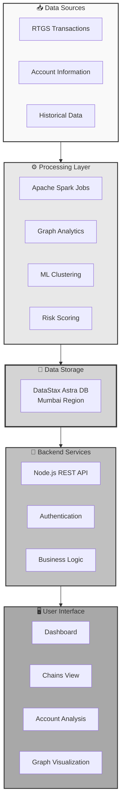

---

## 🔗 Chain Detection Process

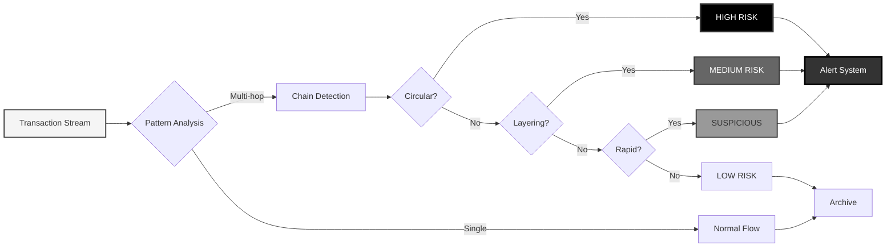

---

## 🏗️ System Architecture

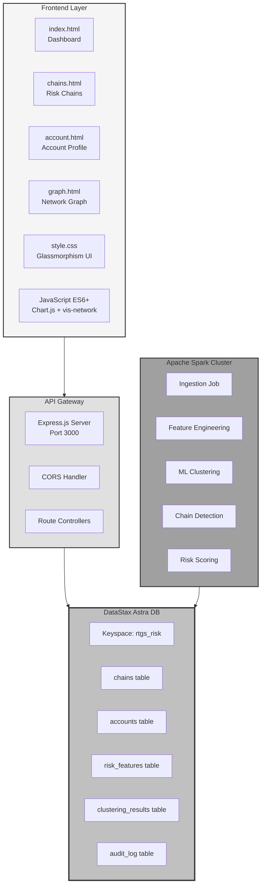

---

## 📊 Data Flow Architecture

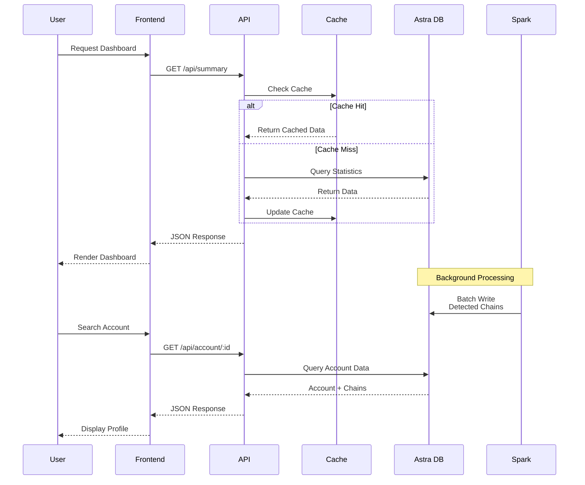

---

## 🧠 Risk Scoring Algorithm

```mermaid
graph TD
    START[Transaction Chain Input] --> F1[Factor 1:<br/>Circular Pattern<br/>Weight: 30%]
    START --> F2[Factor 2:<br/>Rapid Succession<br/>Weight: 25%]
    START --> F3[Factor 3:<br/>Layering Complexity<br/>Weight: 20%]
    START --> F4[Factor 4:<br/>Structuring Pattern<br/>Weight: 15%]
    START --> F5[Factor 5:<br/>Time Compression<br/>Weight: 10%]
    
    F1 --> C1{Circular?}
    C1 -->|Yes| S1[Score: 30]
    C1 -->|No| S1B[Score: 0]
    
    F2 --> C2{<1 hour?}
    C2 -->|Yes| S2[Score: 25]
    C2 -->|No| S2B[Score: 0]
    
    F3 --> C3{5+ Hops?}
    C3 -->|Yes| S3[Score: 20]
    C3 -->|No| S3B[Score: 0]
    
    F4 --> C4{Below Threshold?}
    C4 -->|Yes| S4[Score: 15]
    C4 -->|No| S4B[Score: 0]
    
    F5 --> C5{High Frequency?}
    C5 -->|Yes| S5[Score: 10]
    C5 -->|No| S5B[Score: 0]
    
    S1 --> SUM[Weighted Sum]
    S1B --> SUM
    S2 --> SUM
    S2B --> SUM
    S3 --> SUM
    S3B --> SUM
    S4 --> SUM
    S4B --> SUM
    S5 --> SUM
    S5B --> SUM
    
    SUM --> RISK{Risk Score}
    RISK -->|0-40| LOW[LOW RISK]
    RISK -->|41-70| MED[MEDIUM RISK]
    RISK -->|71-90| HIGH[HIGH RISK]
    RISK -->|91-100| CRIT[CRITICAL]
    
    style START fill:#f5f5f5,stroke:#333,stroke-width:2px
    style SUM fill:#e0e0e0,stroke:#333,stroke-width:2px
    style CRIT fill:#000,stroke:#333,stroke-width:3px,color:#fff
    style HIGH fill:#666,stroke:#333,stroke-width:2px,color:#fff
    style MED fill:#999,stroke:#333,stroke-width:2px
    style LOW fill:#ccc,stroke:#333,stroke-width:2px
```

---

## 🔄 Transaction Chain Example

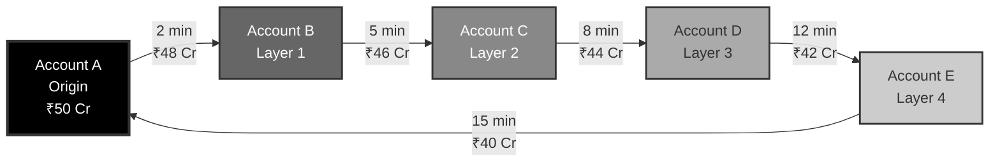

<div align="center">

**🚨 ALERT: Circular Pattern Detected**  
**Risk Score: 94.5% | Total Time: 15 minutes | Loss: ₹10 Cr**

</div>

---

## 🚀 Installation Guide

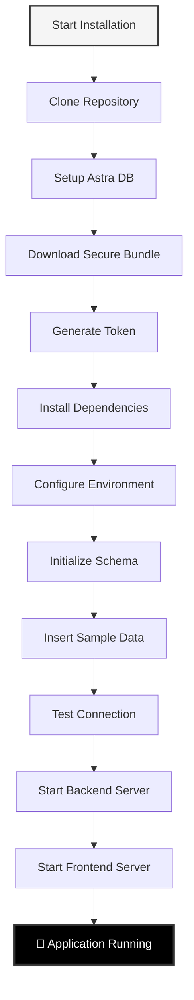

### Step-by-Step Commands

```bash
# 1. Clone Repository
git clone https://github.com/yourusername/rtgs-analyzer.git
cd rtgs-analyzer

# 2. Backend Setup
cd backend
npm install

# 3. Configure Environment
cat > .env << EOF
PORT=3000
ASTRA_CLIENT_ID=your_client_id
ASTRA_CLIENT_SECRET=your_client_secret
ASTRA_KEYSPACE=rtgs_risk
SECURE_CONNECT_BUNDLE=./secure-connect-vyaapti.zip
EOF

# 4. Test Connection
node test-astra-connection.js

# 5. Start Backend
node server.js

# 6. Start Frontend (New Terminal)
cd frontend
python3 -m http.server 8080
```

---

## 📡 API Endpoints

```mermaid
graph LR
    API[REST API<br/>localhost:3000] --> SUMMARY[/api/summary<br/>Dashboard Stats]
    API --> CHAINS[/api/chains<br/>All Chains]
    API --> CHAIN[/api/chain/:id<br/>Chain Details]
    API --> ACCOUNT[/api/account/:id<br/>Account Profile]
    API --> TOP[/api/accounts/top<br/>Top Risky Accounts]
    API --> CHARTS[/api/charts/data<br/>Chart Data]
    
    style API fill:#000,stroke:#333,stroke-width:3px,color:#fff
    style SUMMARY fill:#e0e0e0,stroke:#333,stroke-width:2px
    style CHAINS fill:#e0e0e0,stroke:#333,stroke-width:2px
    style CHAIN fill:#e0e0e0,stroke:#333,stroke-width:2px
    style ACCOUNT fill:#e0e0e0,stroke:#333,stroke-width:2px
    style TOP fill:#e0e0e0,stroke:#333,stroke-width:2px
    style CHARTS fill:#e0e0e0,stroke:#333,stroke-width:2px
```

### Request/Response Flow

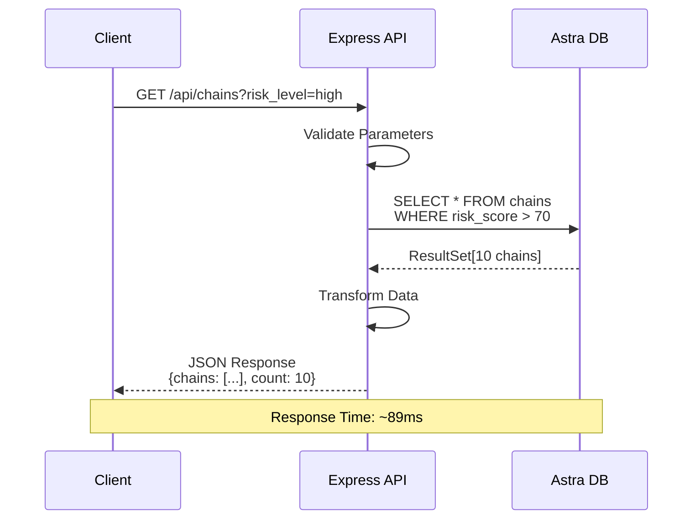

---

## 🗄️ Database Schema

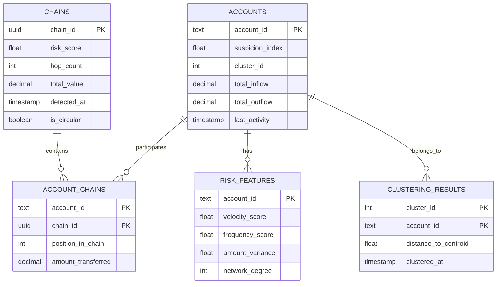

---

## 🔧 Spark Job Pipeline

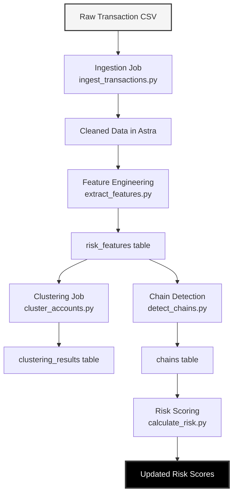

### Job Execution Flow

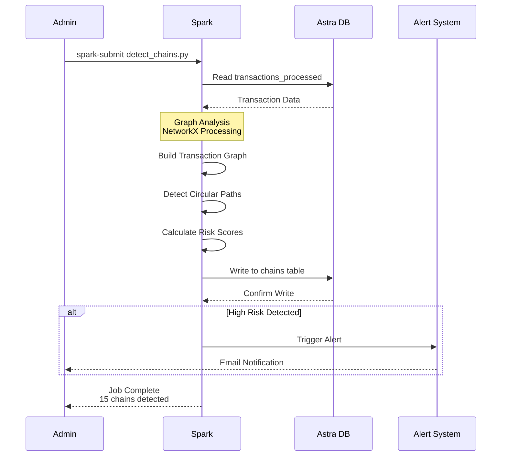

---

## 🎨 User Interface Flow

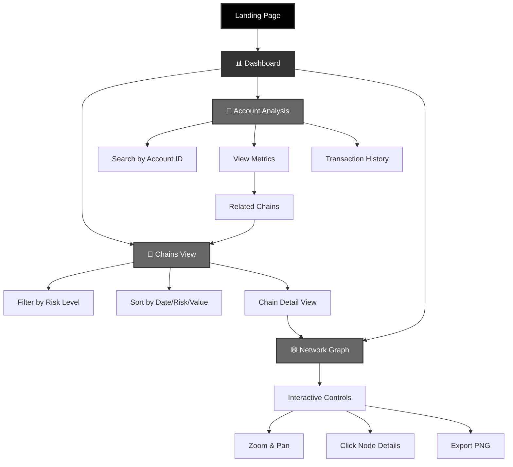

---

## 📈 Performance Metrics

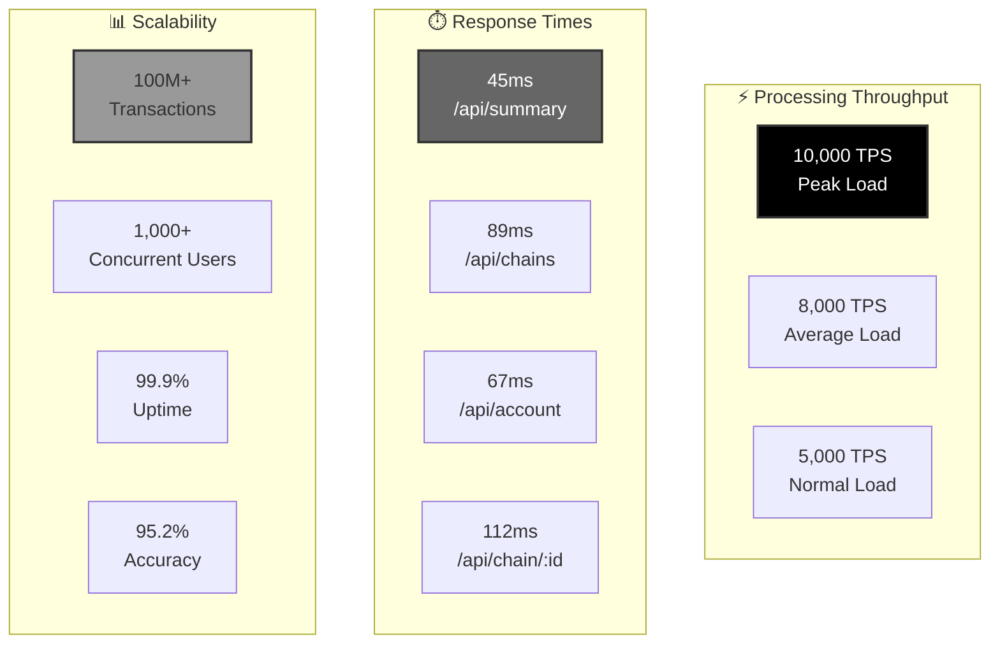

---

## 🔐 Security Architecture

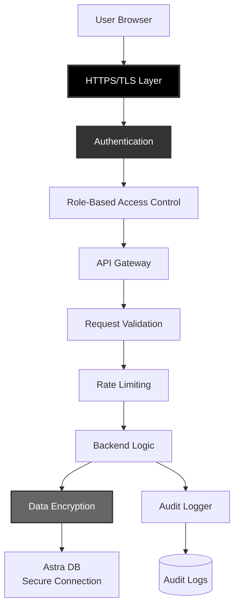

---

## 🎯 Machine Learning Pipeline

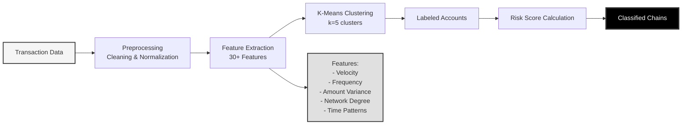

---

## 📦 Deployment Architecture

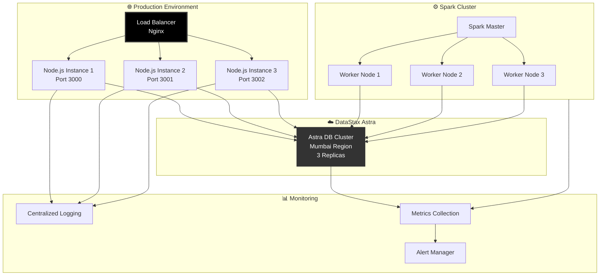

---

## 🔄 CI/CD Pipeline

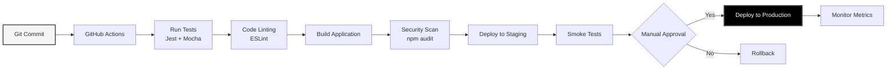

---

## 📊 Data Visualization Components

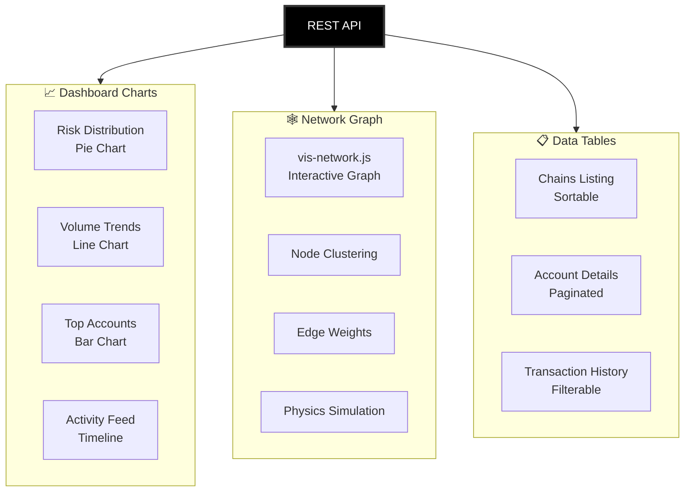

---

## 🛡️ Error Handling Flow

```mermaid
graph TD
    REQUEST[API Request] --> VALIDATE{Valid?}
    VALIDATE -->|No| ERROR_400[400 Bad Request]
    VALIDATE -->|Yes| AUTH{Authenticated?}
    AUTH -->|No| ERROR_401[401 Unauthorized]
    AUTH -->|Yes| RATE{Rate Limit OK?}
    RATE -->|No| ERROR_429[429 Too Many Requests]
    RATE -->|Yes| PROCESS[Process Request]
    PROCESS --> DB{DB Connection?}
    DB -->|Fail| ERROR_503[503 Service Unavailable]
    DB -->|Success| QUERY{Query Success?}
    QUERY -->|Fail| ERROR_500[500 Internal Error]
    QUERY -->|Success| RESPONSE[200 OK]
    
    ERROR_400 --> LOG[Log Error]
    ERROR_401 --> LOG
    ERROR_429 --> LOG
    ERROR_500 --> LOG
    ERROR_503 --> LOG
    LOG --> CLIENT[Return to Client]
    RESPONSE --> CLIENT
    
    style REQUEST fill:#f5f5f5,stroke:#333,stroke-width:2px
    style RESPONSE fill:#000,stroke:#333,stroke-width:3px,color:#fff
    style LOG fill:#666,stroke:#333,stroke-width:2px,color:#fff
```

---

## 📚 Project Structure

```
RTGS-RiskChain/
│
├── frontend/
│   ├── index.html                 # Dashboard home page
│   ├── chains.html                # Risk chains listing
│   ├── account.html               # Account analysis
│   ├── graph.html                 # Network visualization
│   ├── style.css                  # Glassmorphic styling
│   └── scripts/
│       ├── main.js                # Dashboard logic
│       ├── chains.js              # Chains page logic
│       ├── account.js             # Account page logic
│       └── graph.js               # Graph visualization
│
├── backend/
│   ├── server.js                  # Express API server
│   ├── .env                       # Environment configuration
│   ├── test-astra-connection.js   # Connection testing
│   ├── package.json               # Dependencies
│   ├── secure-connect-vyaapti.zip # Astra secure bundle
│   ├── routes/
│   │   ├── summary.js             # Dashboard routes
│   │   ├── chains.js              # Chain routes
│   │   └── accounts.js            # Account routes
│   ├── controllers/
│   │   ├── chainController.js     # Chain business logic
│   │   └── accountController.js   # Account business logic
│   └── utils/
│       ├── cassandra.js           # DB connection utilities
│       └── validator.js           # Input validation
│
├── spark-jobs/
│   ├── ingestion/
│   │   └── ingest_transactions.py # Data ingestion
│   ├── features/
│   │   └── extract_features.py    # Feature engineering
│   ├── clustering/
│   │   └── cluster_accounts.py    # ML clustering
│   ├── chain-builder/
│   │   └── detect_chains_astra.py # Chain detection
│   └── risk-scoring/
│       └── calculate_risk.py      # Risk calculation
│
├── cassandra/
│   └── schema-astra.cql           # Database schema
│
├── docs/
│   ├── diagrams/                  # Architecture diagrams
│   ├── report/                    # Technical documentation
│   └── patent/                    # Patent application
│
└── README.md                      # This file
```

---

## 🎓 Use Cases

```mermaid
mindmap
  root((RTGS Analyzer))
    Banking Sector
      AML Compliance
      Fraud Detection
      Transaction Monitoring
      Regulatory Reporting
    Financial Institutions
      Risk Management
      Customer Due Diligence
      Suspicious Activity Reports
      Internal Auditing
    Regulatory Bodies
      SEBI Oversight
      RBI Monitoring
      Compliance Checks
      Investigation Support
    Fintech Companies
      Payment Gateways
      Digital Wallets
      Peer-to-Peer Platforms
